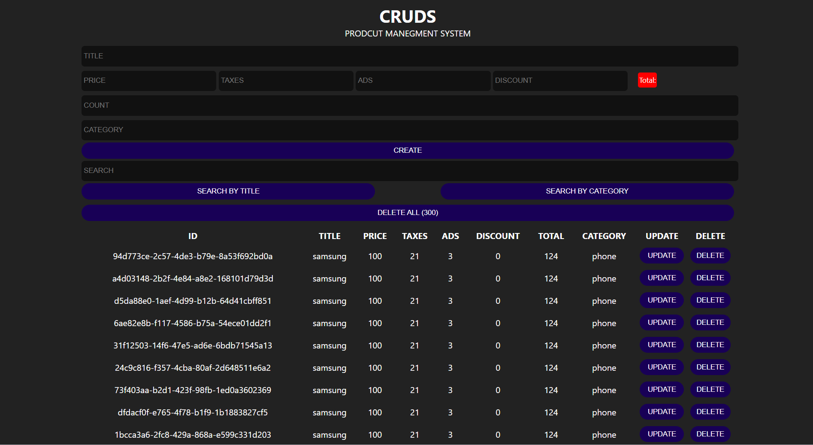

# CRUD Product Management System

This project is a simple CRUD (Create, Read, Update, Delete) application for managing products. It allows users to add, view, update, and delete products, with additional features like search and total price calculation.

## Features

- **Create Products**: Add new products with details like title, price, taxes, ads, discount, and category.
- **Read Products**: View all products in a table format.
- **Update Products**: Modify existing product details.
- **Delete Products**: Remove individual products or delete all products at once.
- **Search**: Search products by title or category.
- **Total Calculation**: Automatically calculate the total price based on price, taxes, ads, and discount.
- **Local Storage**: Save products in the browser's local storage.

## Technologies Used

- **HTML**: Structure of the application.
- **CSS**: Styling the application.
- **JavaScript**: Functionality and interactivity.
- **jQuery**: Simplified DOM manipulation and event handling.

## How to Use

1. Clone the repository or download the project files.
2. Open `index.html` in a browser.
3. Use the input fields to add product details and click the "Create" button.
4. View the products in the table below.
5. Use the "Update" and "Delete" buttons to modify or remove products.
6. Use the search bar to find products by title or category.

## File Structure

- `index.html`: Main HTML file.
- `style.css`: Stylesheet for the application.
- `main.js`: JavaScript file for handling functionality.
- `Product.js`: JavaScript class for managing product data.

## Screenshots

## License

This project is open-source and available under the [MIT License](LICENSE).
